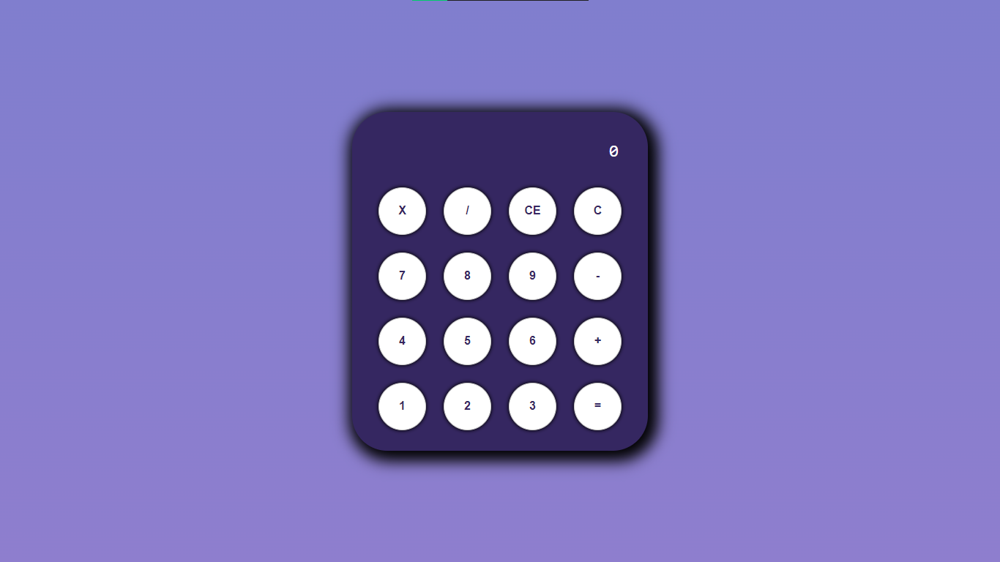

# Calculadora em ReactJS - Primeiro Projeto -

## <Introdução />

Projeto realizado na Formação React Developer da Digital Innovation One.

---

## <TecnologiasConceitosutilizados>

- ReactJS;
- Styled-Components;
- useState();
- Componentes;
- Propriedades de Componentes e Parâmetros;
